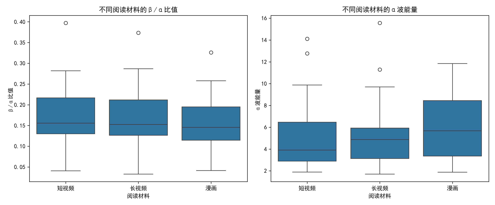

# EEG分析结果报告

## 研究概述
本研究探究了不同阅读材料（长视频、短视频、漫画）对脑电活动的影响。通过分析前额区域的脑电数据，我们计算了α偏侧化指数和注意力投入程度等指标，以评估不同阅读材料对大脑活动的影响。

## 数据概览
- 总被试数: 36
- 实验条件: 长, 漫, 短
- 性别分布:
  - F: 24人
  - M: 12人

## 指标解释
### 主要指标
- **α偏侧化指数**: FP2(右)-FP1(左)的平均功率，反映了大脑左右半球在α波段的活动差异。
  - 正值表示右半球α波活动更强，负值表示左半球α波活动更强。
  - α波与放松状态相关，因此这一指标可能反映了阅读材料引起的情绪或认知加工偏好。

- **注意力投入程度**: α波与β波的比值(α/β)，反映了注意力的投入程度。
  - 较低的值表示β波相对更强，可能对应更高的注意力投入。
  - 较高的值表示α波相对更强，可能对应更放松的状态。

### 标准化指标
为控制个体差异，我们计算了相对于静息状态的标准化指标：
- **标准化α偏侧化指数**: α偏侧化指数除以静息段的相应值。
- **标准化注意力投入程度**: 注意力投入程度除以静息段的相应值。

## 统计分析结果
### 前提检验
#### 正态性检验 (Shapiro-Wilk)
正态性检验用于评估数据是否符合正态分布，p > 0.05表示数据符合正态分布。

| 条件 | 变量 | W统计量 | p值 | 结论 |
|------|------|---------|-----|------|
| 漫 | 标准化α偏侧化指数 | 0.717 | 0.0000 | 不符合正态分布 |
| 漫 | 标准化注意力投入程度 | 0.876 | 0.0008 | 不符合正态分布 |
| 短 | 标准化α偏侧化指数 | 0.220 | 0.0000 | 不符合正态分布 |
| 短 | 标准化注意力投入程度 | 0.874 | 0.0007 | 不符合正态分布 |
| 长 | 标准化α偏侧化指数 | 0.408 | 0.0000 | 不符合正态分布 |
| 长 | 标准化注意力投入程度 | 0.927 | 0.0208 | 不符合正态分布 |

#### 球形性检验 (Mauchly's Test)
球形性检验用于评估不同条件间的方差是否相等，p > 0.05表示满足球形性假设。

##### 标准化α偏侧化指数
```
SpherResults(spher=False, W=0.05679852163371908, chi2=97.52032935975018, dof=2, pval=6.663916441489991e-22)
```

##### 标准化注意力投入程度
```
SpherResults(spher=True, W=0.9432028488664997, chi2=1.9881129174511616, dof=2, pval=0.3700724585027514)
```
#### 球形性检验结果解释
- **标准化α偏侧化指数**: 球形性检验结果表明，不同条件间的方差不满足球形性假设。
- **标准化注意力投入程度**: 球形性检验结果表明，不同条件间的方差满足球形性假设。

### 重复测量方差分析
#### 标准化α偏侧化指数
```
                 Anova
=======================================
          F Value Num DF  Den DF Pr > F
---------------------------------------
Condition  0.9170 2.0000 70.0000 0.4045
=======================================

```

#### 标准化注意力投入程度
```
                 Anova
=======================================
          F Value Num DF  Den DF Pr > F
---------------------------------------
Condition  5.3862 2.0000 70.0000 0.0067
=======================================

```
### 重复测量方差分析结果解释
- **标准化α偏侧化指数**: 条件间的F值为0.9170，p值为0.4045，不显著。
- **标准化注意力投入程度**: 条件间的F值为5.3862，p值为0.0067，显著。
### 配对t检验结果
使用Bonferroni校正进行多重比较，校正后的显著性水平为0.05/3 = 0.0167。

#### 标准化α偏侧化指数
- 长 vs 短: t=-0.866, p=0.3923, 不显著
- 长 vs 漫: t=1.329, p=0.1925, 不显著
- 短 vs 漫: t=1.029, p=0.3108, 不显著

#### 标准化注意力投入程度
- 长 vs 短: t=-2.934, p=0.0059, 显著
- 长 vs 漫: t=-2.047, p=0.0483, 不显著
- 短 vs 漫: t=1.431, p=0.1614, 不显著

### 检验结果解释
- **标准化α偏侧化指数**: 配对t检验结果表明，不同阅读材料之间的α偏侧化指数差异不显著

- **标准化注意力投入程度**: 配对t检验结果表明，只有长视频和短视频阅读材料之间的注意力投入程度差异显著，其余不显著

## 描述性统计
### 标准化α偏侧化指数
| 条件 | 均值 | 标准差 | 样本量 |
|------|------|--------|--------|
| 长 | 7.1089 | 27.0177 | 36 |
| 短 | 28.7555 | 153.1779 | 36 |
| 漫 | 2.3213 | 8.2459 | 36 |

### 标准化注意力投入程度
| 条件 | 均值 | 标准差 | 样本量 |
|------|------|--------|--------|
| 长 | 0.4897 | 0.2682 | 36 |
| 短 | 0.6123 | 0.4226 | 36 |
| 漫 | 0.5620 | 0.3531 | 36 |

## 图表说明
### 箱线图


### 箱线图解释
分析结果包含四个箱线图，分别展示了不同阅读材料条件下的以下指标：

1. **标准化α偏侧化指数**
   - 箱体中线表示中位数
   - 箱体上下边界分别表示第一和第三四分位数
   - 离群点表示异常值
   - 这一指标反映了不同阅读材料对大脑左右半球α波活动的影响

2. **标准化注意力投入程度**
   - 较低的值表示更高的注意力投入
   - 较高的值表示更放松的状态
   - 这一指标反映了不同阅读材料需要的注意力投入程度

3. **α偏侧化指数**（未标准化）
   - 展示了原始的α偏侧化指数，未经过静息状态标准化
   - 可用于比较标准化前后的差异

4. **注意力投入程度**（未标准化）
   - 展示了原始的注意力投入程度，未经过静息状态标准化
   - 可用于比较标准化前后的差异

## 研究结论
根据以上分析结果，我们可以得出以下初步结论：

1. 不同阅读材料在激活大脑注意力方面存在差异，尤其是长视频与短视频之间；
2. α偏侧化指数未表现出显著差异，但不同材料可能激活不同脑区；
3. 注意力投入程度的统计结果支持短视频对大脑注意力资源的调动较高。

## 研究局限性
1. 样本量有限，结果可能受到个体差异的影响。
2. 只使用了前额区域的两个电极(FP1和FP2)，无法全面反映整个大脑的活动情况。
3. 环境因素和实验过程中的干扰可能影响了数据的质量。
4. 部分数据存在缺失或异常值，可能影响了统计分析的准确性。

## 未来研究方向
1. 增加样本量，提高统计检验的效力。
2. 使用更多电极位置，获取更全面的脑电活动信息。
3. 结合其他生理指标（如心率、皮电等），进行多模态分析。
4. 探究不同阅读材料对不同人群（如不同年龄、教育背景）的影响差异。
